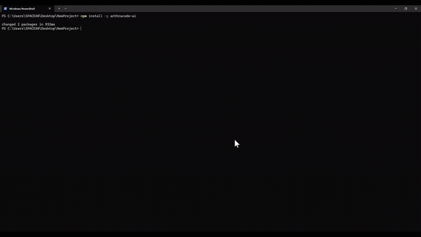
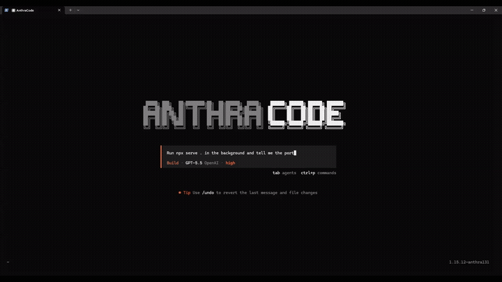
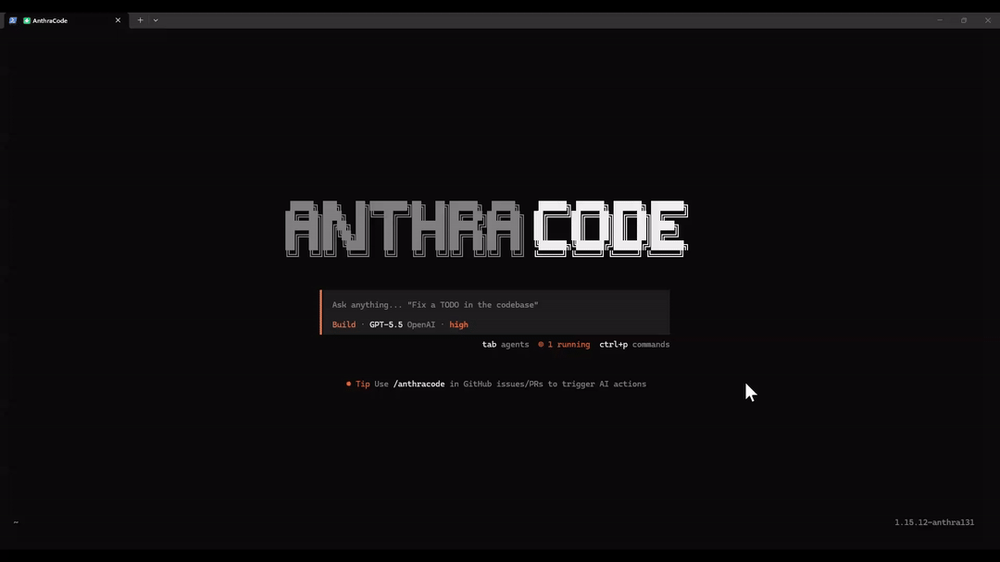
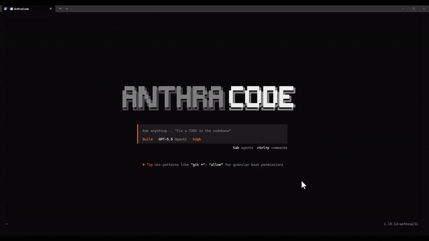
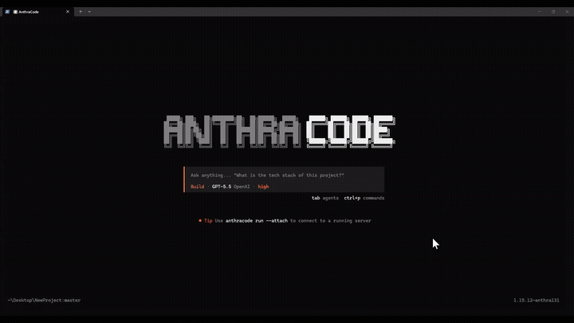
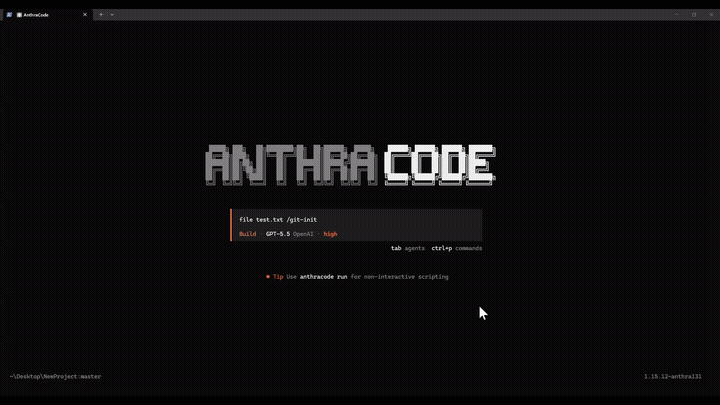
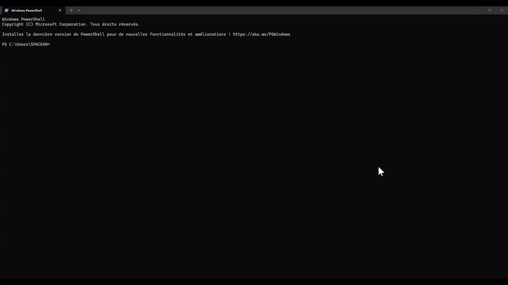

<div align="center">

# Anthracode

**A local-first AI coding agent for your terminal.**

Read, edit, refactor, run commands, manage context, use specialized agents, and
ship code from a fast TUI, with native macOS, Windows, and Linux binaries.

```bash
npm install -g anthracode-ai
anthracode
```

[](https://www.npmjs.com/package/anthracode-ai)
[](https://www.npmjs.com/package/anthracode-ai)
[](#supported-platforms)
[](LICENSE)

[Website](https://www.anthracode.com) · [Docs](https://docs.anthracode.com) · [npm](https://www.npmjs.com/package/anthracode-ai) · [Report an issue](../../issues)

</div>

---

## Contents

- [What is Anthracode?](#what-is-anthracode)
- [What's different](#whats-different)
- [Preview](#preview)
- [Highlights](#highlights)
- [Install](#install)
- [Quick start](#quick-start)
- [Supported platforms](#supported-platforms)
- [Core tools](#core-tools)
- [Agent modes](#agent-modes)
- [Configuration](#configuration)
- [Privacy](#privacy)
- [Updating](#updating)
- [Troubleshooting](#troubleshooting)
- [Project status](#project-status)
- [Legal & community](#legal--community)

---

## What is Anthracode?

Anthracode is an AI coding assistant that runs in your terminal as a full-screen
TUI. Connect it to the model and provider you already use, then ask it to inspect,
edit, test, refactor, and explain your codebase.

Anthracode works on your **local files and local tools**. There is no required
cloud workspace and no required Anthracode account to use the terminal agent.

It started as a fork of [OpenCode](https://github.com/anomalyco/opencode) and took
a different bet: keep OpenCode's freedom to use any provider, then add the memory,
recall, and real terminal sessions that the other terminal agents leave out.

---

## What's different

The honest comparison, current as of the latest release. These are the rows that
actually change how the agent feels day to day, not an exhaustive feature dump.

| Capability | Anthracode | OpenCode | Claude Code | Codex CLI |
| --- | --- | --- | --- | --- |
| Reversible compaction (`/uncompact` restores the full conversation) | ✅ | ❌ | one-way only | ❌ |
| Full-history recall (search even compacted-away turns) | ✅ | ❌ | ❌ | ❌ |
| Persistent 4-tier memory (session · espace · account · skill) | ✅ | `AGENTS.md` | single tier | `AGENTS.md` |
| Interactive terminal sessions (real keystrokes, crash-isolated PTY) | ✅ | ❌ | background shell | ❌ |
| Background process manager (dev servers, watchers) | first class | ❌ | partial | ❌ |
| Specialized subagents with scoped permissions | 5 built-in | generic | configure yourself | ❌ |
| Background subagents: steer mid-flight, auto-notified on finish, run on a cheaper/stronger model per task | ✅ | ❌ | ✅ | partial |
| Native Windows TUI (ConPTY, alternate screen, no WSL) | first class | rough | ✅ | WSL recommended |
| Any model provider, your keys, local LLMs included | ✅ | ✅ | Anthropic only | OpenAI only |
| Free to start, no subscription required | yes, your keys | ✅ | sub or API | ChatGPT sub |
| Source code | MIT releases, source private | MIT | proprietary | Apache-2.0 |

Claude Code does run native on Windows and has a background shell; Codex CLI is
Apache-2.0. The point is the combination: Anthracode is the only one of the four
with reversible compaction, full-history recall, and crash-isolated interactive
sessions in one any-provider agent.

---

## Preview

Short demos from the Anthracode web presentation, rendered inline so the README
feels closer to the website experience.

### Native Windows terminal

Run Anthracode directly in PowerShell or Windows Terminal, no WSL required.



### Background process manager

Start long-running commands, keep them visible, and reconnect to their output
without losing control of your session. Background subagents live in the same
panel: watch them work, open their live output, stop them with a key — and send
them course corrections mid-flight instead of killing and restarting.



### Memory for decisions

Anthracode remembers important project knowledge so you do not have to explain
the same decisions again next week.



### Drop-in skills

Add reusable workflows as skills and load the right process when the task needs
it.



### Type-aware and internet-aware

Use code intelligence and web context together: definitions, references, symbols,
docs, and current information in one terminal workflow.


### Safe git workflows

Anthracode warns before irreversible actions and keeps repo changes visible.



### Git init without leaving the prompt

Initialize project instructions and repo context from inside the TUI.



### Per-invocation overrides

Override model, agent, permissions, or behavior for a single run without changing
your project defaults.



---

## Highlights

- **Terminal-native workflow.** Ask, plan, build, review, and run commands from one TUI.
- **Local-first by default.** Your code stays on your machine and is sent only to the model provider you configure.
- **Native macOS support.** Apple Silicon (arm64) and Intel (x64) binaries.
- **Native Windows support.** Real Windows x64 binary, PowerShell-friendly paths, ConPTY-backed terminal handling.
- **Linux support.** Native binaries for x64 and arm64, glibc and musl — bare metal, WSL, Docker, and Alpine containers.
- **Persistent memory.** Preserve useful context and project knowledge across sessions.
- **Specialized agents.** Use focused agents for planning, building, testing, security review, refactoring, and architecture.
- **Rich tool system.** Files, shell, PTY sessions, code search, LSP, notebooks, web search, MCP, checkpoints, and worktrees.
- **Safer autonomous work.** Permission gates, timeouts, checkpoints, type checks, and test runners.

---

## Install

### npm

```bash
npm install -g anthracode-ai --include=optional
anthracode
```

### pnpm

```bash
pnpm add -g anthracode-ai
anthracode
```

### yarn

```bash
yarn global add anthracode-ai
anthracode
```

### macOS / Linux / WSL curl installer

```bash
curl -fsSL https://www.anthracode.com/install | bash
anthracode
```

The curl installer uses your existing Node.js 18+ and npm if available. If Node
is missing or too old, it installs a local Node.js runtime under
`~/.local/share/anthracode/node`, persists PATH, then installs `anthracode-ai`.

---

## Quick start

```bash
# Start Anthracode in the current project
anthracode

# Or start in a specific project
anthracode /path/to/project
```

Inside the TUI:

```txt
/connect   configure your provider/API key
/init      analyze the project and create project instructions
/help      list available commands
/model     pick a model
```

Example prompts:

```txt
Explain how authentication works in this repo.
```

```txt
Create a plan to add dark mode, then wait for approval.
```

```txt
Refactor the billing API route and run the tests after each change.
```

---

## Supported platforms

| Platform | Status | Notes |
| --- | --- | --- |
| macOS (Apple Silicon) | ✅ Supported | Native arm64 binary. |
| macOS (Intel) | ✅ Supported | Native x64 binary. |
| Windows x64 | ✅ Supported | Native binary. Works in PowerShell and Windows Terminal. |
| Linux x64 | ✅ Supported | Native optional npm binary. Works well in WSL too. |
| Linux arm64 | ✅ Supported | Native binary — AWS Graviton, Raspberry Pi, ARM servers. |
| Linux x64 (Alpine/musl) | ✅ Supported | Native musl binary for Alpine-based containers. |
| Linux arm64 (Alpine/musl) | ✅ Supported | Native musl binary — Alpine on ARM. |

---

## Core tools

| Tool area | What Anthracode can do |
| --- | --- |
| Files | Read, write, patch, and batch-edit files. |
| Search | Glob, grep, AST search, symbol lookup, LSP references. |
| Terminal | Run shell commands, stream output, manage PTY sessions. |
| Git | Detect diffs, use isolated worktrees, checkpoint and restore state. |
| Tests | Run type checks and test suites with structured failure output. |
| Runtime | Execute Python, Node.js, or Bun snippets. |
| Notebooks | Edit Jupyter notebook cells safely. |
| Web | Fetch pages and search the web when enabled. |
| MCP | Connect external MCP servers and tools. |

---

## Agent modes

| Mode / agent | Purpose |
| --- | --- |
| Ask | Read-only help, explanations, codebase questions. |
| Plan | Design an implementation before making changes. |
| Build | Edit files, run tools, and implement changes. |
| Tester | Write and run tests, report failures. |
| Security | Read-only OWASP-style review. |
| Refactor | Improve existing code while preserving behavior. |
| Architect | Produce structured implementation plans. |

---

## Configuration

Anthracode can be configured globally or per project.

Common locations:

- Global config: `~/.config/anthracode/anthracode.jsonc`
- Project config: `.anthracode/anthracode.jsonc`
- Project instructions: `AGENTS.md`

Minimal example:

```jsonc
{
  "model": "anthropic/claude-sonnet-4-5"
}
```

Supported provider types include Anthropic, OpenAI, Google Gemini, Groq,
Mistral, Bedrock, Azure, Ollama, LM Studio, and OpenAI-compatible endpoints.

---

## Privacy

Anthracode is **local-first**.

- Your files are read from your local machine.
- Prompts and context are sent only to the model provider you configure.
- No Anthracode cloud account is required for the terminal agent.
- No analytics SDK is required for local CLI usage.

See [PRIVACY.md](PRIVACY.md) for the full data-flow details.

---

## Updating

```bash
npm install -g anthracode-ai@latest --include=optional
```

Anthracode also checks for updates on launch and can prompt you when a newer
version is available.

---

## Troubleshooting

### The binary did not install

Re-run with optional dependencies enabled:

```bash
npm install -g anthracode-ai --include=optional
```

### `anthracode` is not found after install

Check your global npm bin path:

```bash
npm bin -g
```

Then make sure that directory is in your `PATH`.

### Windows terminal issues

Update to the latest package first:

```powershell
npm install -g anthracode-ai@latest --include=optional
```

Use Windows Terminal or PowerShell for the best native experience.

---

## Project status

| Area | Status |
| --- | --- |
| macOS binaries (Apple Silicon + Intel) | ✅ Supported |
| Windows x64 CLI | ✅ Supported |
| Linux x64 CLI | ✅ Supported |
| Terminal TUI | ✅ Supported |
| Memory / tools / agents | ✅ Supported |
| Linux arm64 binary | 🚧 Planned |
| Browser-hosted chat UI | ❌ Not currently supported |
| Hosted model gateway / subscription | ❌ Not currently supported |

---

## Legal & community

| Document | What it covers |
| --- | --- |
| [LICENSE](LICENSE) | Source license. |
| [LEGAL_NOTICE.md](LEGAL_NOTICE.md) | Publisher identity / mentions légales. |
| [TERMS.md](TERMS.md) | Terms for distributed binaries. |
| [PRIVACY.md](PRIVACY.md) | What data leaves your machine and when. |
| [SECURITY.md](SECURITY.md) | How to report a vulnerability. |
| [TRADEMARK.md](TRADEMARK.md) | Use of the Anthracode name and logo. |
| [NOTICE](NOTICE) | Third-party attributions. |
| [CONTRIBUTING.md](CONTRIBUTING.md) | How to report bugs and contribute. |
| [CODE_OF_CONDUCT.md](CODE_OF_CONDUCT.md) | Community standards. |

---

## License

Anthracode source code is licensed under the [MIT License](LICENSE). The
Anthracode name and logo are trademarks; see [TRADEMARK.md](TRADEMARK.md).
