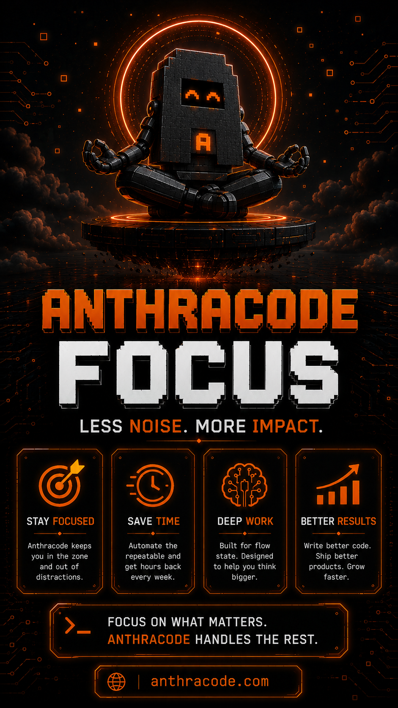

<div align="center">

# Anthracode

**A local-first AI coding agent for your terminal.**

Read, edit, refactor, run commands, manage context, use specialized agents, and
ship code from a fast TUI — with native Windows x64 and Linux x64 support.

```bash
npm install -g anthracode-ai
anthracode
```

[](https://www.npmjs.com/package/anthracode-ai)
[](#supported-platforms)
[](LICENSE)

[Website](https://www.anthracode.com) · [Docs](https://docs.anthracode.com) · [npm](https://www.npmjs.com/package/anthracode-ai) · [Report an issue](../../issues)

</div>

---

## Preview

Anthracode is built as a practical coding agent: it remembers context, turns
repeatable prompts into reusable skills, helps you stay focused, and runs where
developers already work.

<p align="center">
  
</p>

### Remember more

Anthracode keeps useful project knowledge across sessions so you do not have to
explain the same repo, conventions, or workflow twice.

<p align="center">
  
</p>

### Build reusable skills

Convert repetitive workflows into skills: code review, API integration, auth
flows, database migrations, test suites, deployment scripts, and more.

<p align="center">
  
</p>

### Ship safer code

Use permission gates, sandboxed execution, privacy-first local workflows, and
security-focused agents to review risky changes before they ship.

<p align="center">
  
</p>

### Stay focused

Anthracode handles repetitive terminal work so you can spend more time on design,
architecture, debugging, and high-impact code.

<p align="center">
  
</p>

### Work where you work

Run Anthracode natively on Windows x64 or Linux x64, including WSL, with one CLI
experience across environments.

<p align="center">
  
</p>

---

## What is Anthracode?

Anthracode is an AI coding assistant that runs in your terminal as a full-screen
TUI. Connect it to the model/provider you already use, then ask it to inspect,
edit, test, refactor, and explain your codebase.

Anthracode works on your **local files and local tools**. There is no required
cloud workspace and no required Anthracode account to use the terminal agent.

---

## Highlights

- **Terminal-native workflow** — ask, plan, build, review, and run commands from one TUI.
- **Local-first by default** — your code stays on your machine and is sent only to the model provider you configure.
- **Native Windows support** — real Windows x64 binary, PowerShell-friendly paths, ConPTY-backed terminal handling.
- **Linux x64 support** — published optional binary for fast installs.
- **Persistent memory** — preserve useful context and project knowledge across sessions.
- **Specialized agents** — use focused agents for planning, building, testing, security review, refactoring, and architecture.
- **Rich tool system** — files, shell, PTY sessions, code search, LSP, notebooks, web search, MCP, checkpoints, and worktrees.
- **Safer autonomous work** — permission gates, timeouts, checkpoints, type checks, and test runners.

---

## Install

### npm

```bash
npm install -g anthracode-ai --include=optional
anthracode
```

### pnpm

```bash
pnpm add -g anthracode-ai
anthracode
```

### yarn

```bash
yarn global add anthracode-ai
anthracode
```

### Linux / WSL curl installer

```bash
curl -fsSL https://www.anthracode.com/install | bash
anthracode
```

The curl installer uses your existing Node.js 18+ and npm if available. If Node
is missing or too old, it installs a local Node.js runtime under
`~/.local/share/anthracode/node`, persists PATH, then installs `anthracode-ai`.

---

## Supported platforms

| Platform | Status | Notes |
| --- | --- | --- |
| Windows x64 | ✅ Supported | Native binary. Works in PowerShell and Windows Terminal. |
| Linux x64 | ✅ Supported | Native optional npm binary. Works well in WSL too. |
| macOS | 🚧 Planned | Apple Silicon and Intel builds are planned. |
| Linux arm64 | 🚧 Planned | Not shipped yet. |

---

## Quick start

```bash
# Start Anthracode in the current project
anthracode

# Or start in a specific project
anthracode /path/to/project
```

Inside the TUI:

```txt
/connect   configure your provider/API key
/init      analyze the project and create project instructions
/help      list available commands
/model     pick a model
```

Example prompts:

```txt
Explain how authentication works in this repo.
```

```txt
Create a plan to add dark mode, then wait for approval.
```

```txt
Refactor the billing API route and run the tests after each change.
```

---

## Core tools

| Tool area | What Anthracode can do |
| --- | --- |
| Files | Read, write, patch, and batch-edit files. |
| Search | Glob, grep, AST search, symbol lookup, LSP references. |
| Terminal | Run shell commands, stream output, manage PTY sessions. |
| Git | Detect diffs, use isolated worktrees, checkpoint and restore state. |
| Tests | Run type checks and test suites with structured failure output. |
| Runtime | Execute Python, Node.js, or Bun snippets. |
| Notebooks | Edit Jupyter notebook cells safely. |
| Web | Fetch pages and search the web when enabled. |
| MCP | Connect external MCP servers and tools. |

---

## Agent modes

| Mode / agent | Purpose |
| --- | --- |
| Ask | Read-only help, explanations, codebase questions. |
| Plan | Design an implementation before making changes. |
| Build | Edit files, run tools, and implement changes. |
| Tester | Write/run tests and report failures. |
| Security | Read-only OWASP-style review. |
| Refactor | Improve existing code while preserving behavior. |
| Architect | Produce structured implementation plans. |

---

## Configuration

Anthracode can be configured globally or per project.

Common locations:

- Global config: `~/.config/anthracode/anthracode.jsonc`
- Project config: `.anthracode/anthracode.jsonc`
- Project instructions: `AGENTS.md`

Minimal example:

```jsonc
{
  "model": "anthropic/claude-sonnet-4-5"
}
```

Supported provider types include Anthropic, OpenAI, Google Gemini, Groq,
Mistral, Bedrock, Azure, Ollama, LM Studio, and OpenAI-compatible endpoints.

---

## Privacy

Anthracode is **local-first**.

- Your files are read from your local machine.
- Prompts/context are sent only to the model provider you configure.
- No Anthracode cloud account is required for the terminal agent.
- No analytics SDK is required for local CLI usage.

See [PRIVACY.md](PRIVACY.md) for the full data-flow details.

---

## Updating

```bash
npm install -g anthracode-ai@latest --include=optional
```

Anthracode also checks for updates on launch and can prompt you when a newer
version is available.

---

## Troubleshooting

### The binary did not install

Re-run with optional dependencies enabled:

```bash
npm install -g anthracode-ai --include=optional
```

### `anthracode` is not found after install

Check your global npm bin path:

```bash
npm bin -g
```

Then make sure that directory is in your `PATH`.

### Windows terminal issues

Update to the latest package first:

```powershell
npm install -g anthracode-ai@latest --include=optional
```

Use Windows Terminal or PowerShell for the best native experience.

---

## Project status

| Area | Status |
| --- | --- |
| Windows x64 CLI | ✅ Supported |
| Linux x64 CLI | ✅ Supported |
| Terminal TUI | ✅ Supported |
| Memory/tools/agents | ✅ Supported |
| macOS binaries | 🚧 Planned |
| Linux arm64 binary | 🚧 Planned |
| Browser-hosted chat UI | ❌ Not currently supported |
| Hosted model gateway/subscription | ❌ Not currently supported |

---

## Legal & community

| Document | What it covers |
| --- | --- |
| [LICENSE](LICENSE) | Source license. |
| [LEGAL_NOTICE.md](LEGAL_NOTICE.md) | Publisher identity / mentions légales. |
| [TERMS.md](TERMS.md) | Terms for distributed binaries. |
| [PRIVACY.md](PRIVACY.md) | What data leaves your machine and when. |
| [SECURITY.md](SECURITY.md) | How to report a vulnerability. |
| [TRADEMARK.md](TRADEMARK.md) | Use of the Anthracode name and logo. |
| [NOTICE](NOTICE) | Third-party attributions. |
| [CONTRIBUTING.md](CONTRIBUTING.md) | How to report bugs and contribute. |
| [CODE_OF_CONDUCT.md](CODE_OF_CONDUCT.md) | Community standards. |

---

## License

Anthracode source code is licensed under the [MIT License](LICENSE). The
Anthracode name and logo are trademarks; see [TRADEMARK.md](TRADEMARK.md).
